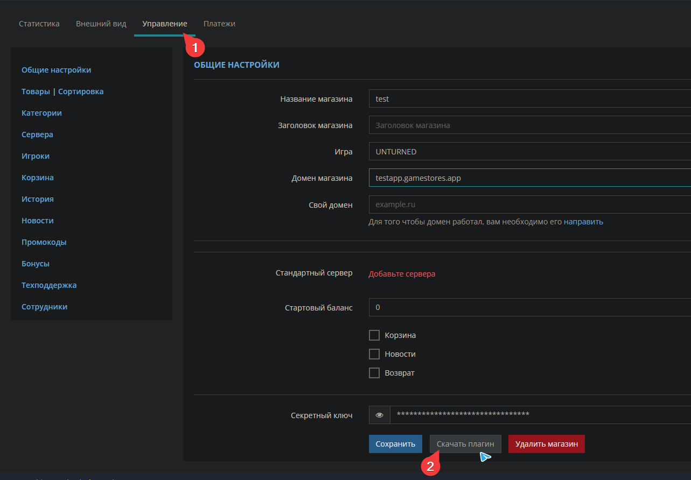
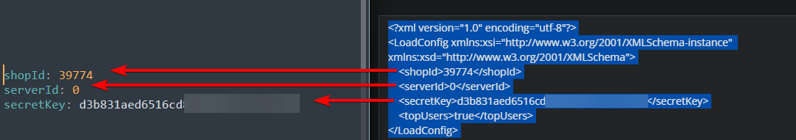

# EvolutionPlugins.GameStores
Неофициальный OpenMod плагин для вебсайта https://gamestores.app/  
An unofficial OpenMod plugin for https://gamestores.app/ donation website

## Как установить\обновить плагин | How install\update plugin
Install plugin with command: `openmod install EvolutionPlugins.GameStores`

## Commands
- `store <all, page, take>` 
  id: `EvolutionPlugins.GameStores.Commands.CommandStore` 
  permission: `EvolutionPlugins.GameStores:commands.store`: Grants access to the EvolutionPlugins.GameStores.Commands.CommandStore command.
- `store all` 
  id: `EvolutionPlugins.GameStores.Commands.CommandStoreAll` 
  permission: `EvolutionPlugins.GameStores:commands.store.all`: Grants access to the EvolutionPlugins.GameStores.Commands.CommandStoreAll command.
- `store page <page>` 
  id: `EvolutionPlugins.GameStores.Commands.CommandStorePage` 
  permission: `EvolutionPlugins.GameStores:commands.store.page`: Grants access to the EvolutionPlugins.GameStores.Commands.CommandStorePage command.
- `store take <index>` 
  id: `EvolutionPlugins.GameStores.Commands.CommandStoreTake` 
  permission: `EvolutionPlugins.GameStores:commands.store.take`: Grants access to the EvolutionPlugins.GameStores.Commands.CommandStoreTake command.
  
## Configuration
 

## Support discord
https://discord.gg/5MT2yke